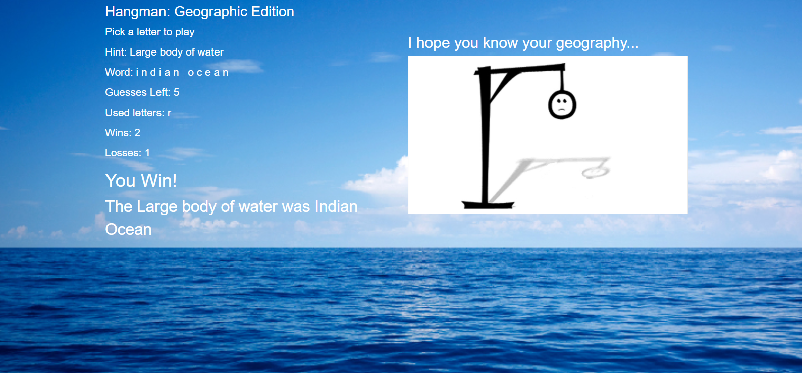
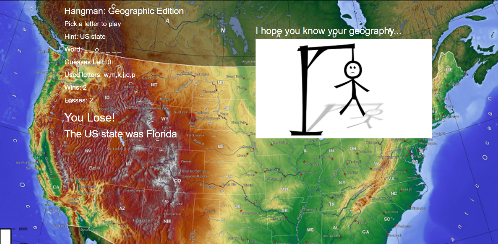

# Hangman: Geographic Edition
Welcome to my geography hangman, made using vanilla JavaScript.  Once a user goes to the page a random geographic category is selected and a word from an array for that category is randomly selected.  The word is changed into blanks and the player can guess letters by pressing the letter on a keyboard.  If they guess wrong to many times, well we all know what happens...  
  

